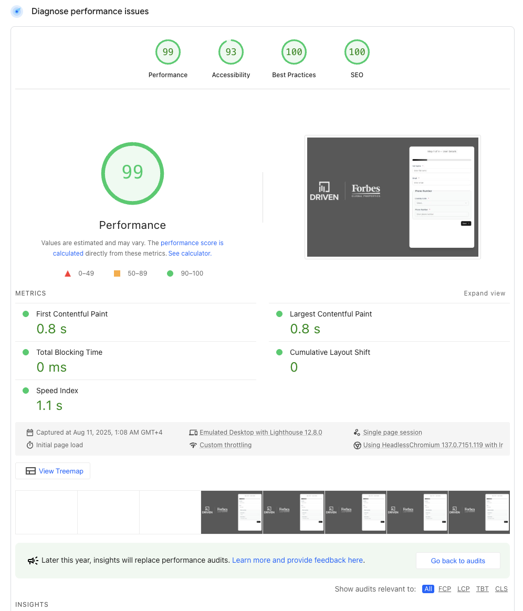
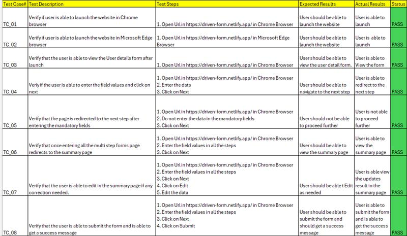

# 📋 Schema-Driven Multi-Step Forms with EMI Calculator

A **schema-driven multi-step forms** application built with **Next.js**, **Tailwind CSS**, and **shadcn UI**.  
It dynamically renders form fields and steps based on a **JSON schema**, allowing flexible customization without modifying code for every form variation.  

The project also includes an **integrated EMI calculator**, enabling users to instantly estimate monthly loan payments based on the entered values.

---

## ✨ Key Features

- **Schema-Driven Form Rendering**  
  Define form structure, fields, validations, and dependencies entirely in JSON — no need to hardcode inputs.  
  This allows rapid adjustments to form workflows.

- **Multi-Step Navigation**  
  Organizes complex forms into multiple steps for a better user experience. Users can go back and edit previous steps at any time.

- **Conditional Rendering**  
  Form fields can appear or hide dynamically based on other field values, controlled by schema-defined dependencies.

- **Dynamic Option Loading**  
  Select fields can fetch their options from **external APIs or predefined data sources** dynamically.

- **Real-Time Validation**  
  Validation is powered by **Zod**, with schemas generated directly from the form definition.

- **Integrated EMI Calculator**  
  At the final step, users can calculate their **Equated Monthly Installments** instantly using loan amount, interest rate, and tenure.

---

## 📽 Demo Video

[](https://youtu.be/jvaKhEbF8DE)

---

## 📊 Website Performance Report



---

## 🧪 Unit Testing Report



---

## 🛠 Tech Stack

- **Framework:** [Next.js 15](https://nextjs.org/)
- **Styling:** [Tailwind CSS](https://tailwindcss.com/)
- **UI Components:** [shadcn/ui](https://ui.shadcn.com/)
- **Form Handling:** [React Hook Form](https://react-hook-form.com/)
- **Validation:** [Zod](https://zod.dev/)

---

## 🚀 Installation & Setup

Clone the repository:

```bash
git clone https://github.com/yourusername/schema-driven-forms.git
cd schema-driven-forms
